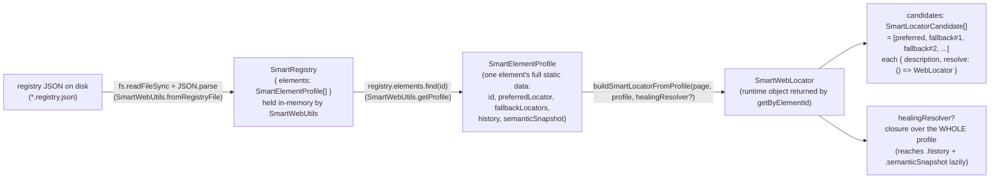
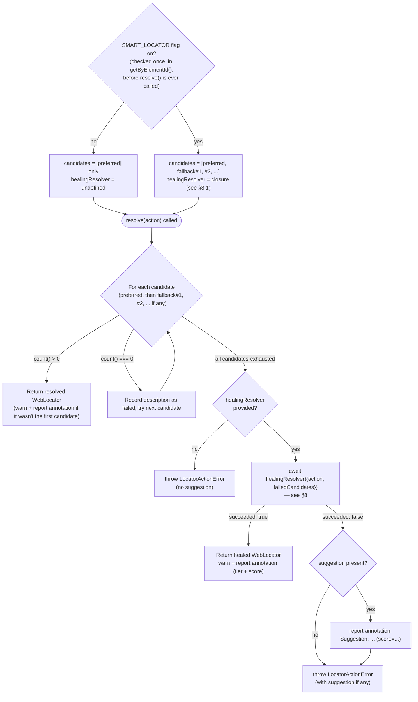
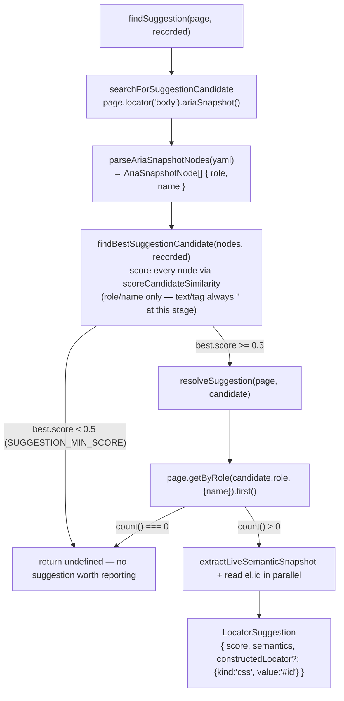
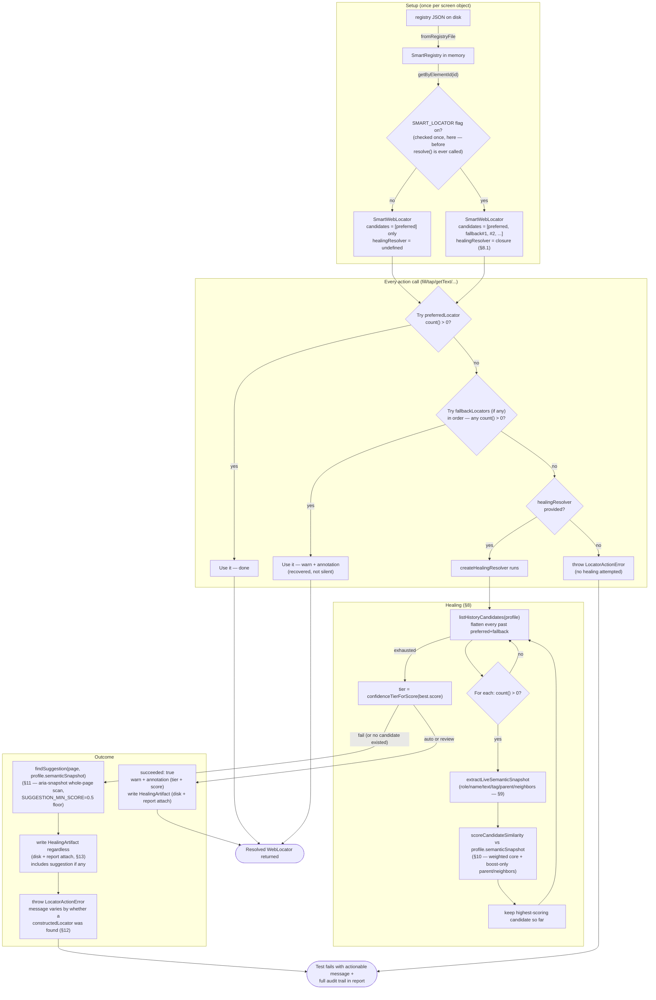

# Smart Locator Architecture (Web Surface)

Status: **fully implemented and running**, `apps/web/utils/smart-*.ts` + `core/utils/*` + `core/config/*`.
Every method, type, and business rule described below exists in the repository today and is exercised by
`apps/web/sample/tests/web_smart_chromium.spec.ts`.

## Table of contents

1. [Objective & design philosophy](#1-objective--design-philosophy)
2. [File map](#2-file-map)
3. [Feature flags](#3-feature-flags)
4. [Registry data model & type tree](#4-registry-data-model--type-tree)
5. [Locator strategies & priority order](#5-locator-strategies--priority-order)
6. [Data flow — registry JSON → runtime objects](#6-data-flow--registry-json--runtime-objects)
7. [Resolution flow — `SmartWebLocator.resolve()`](#7-resolution-flow--smartweblocatorresolve)
8. [Healing deep dive — `createHealingResolver`](#8-healing-deep-dive--createhealingresolver)
9. [Semantic snapshot extraction — `extractLiveSemanticSnapshot`](#9-semantic-snapshot-extraction--extractlivesemanticsnapshot)
10. [Similarity & scoring engine](#10-similarity--scoring-engine)
11. [Suggestion search — last resort](#11-suggestion-search--last-resort)
12. [Error shape — `LocatorActionError` / `LocatorSuggestion`](#12-error-shape--locatoractionerror--locatorsuggestion)
13. [Report visibility — annotations & attachments](#13-report-visibility--annotations--attachments)
14. [Snapshot graph evidence — `snapshot-graph.utils.ts`](#14-snapshot-graph-evidence--snapshot-graphutilsts)
15. [Registry linting](#15-registry-linting)
16. [Sample assets walkthrough](#16-sample-assets-walkthrough)
17. [Known gaps & future work](#17-known-gaps--future-work)
18. [Full combined flow diagram](#18-full-combined-flow-diagram)

---

## 1. Objective & design philosophy

**Problem this framework solves:** UI locators break when the DOM changes (renamed ids, restructured
markup, reworded labels). Traditional automation typically hard-fails immediately — bad for a QA
framework other people are expected to trust, and especially bad for the
[prompt-driven QA end goal](../../CLAUDE.md#end-goal--prompt-driven-qa): an LLM composing tests needs
deterministic, explainable behavior, not a black box.

**Design philosophy — deterministic execution first, AI-assisted recovery second, never silent:**

1. Always try the locator a human explicitly authored first (`preferredLocator`).
2. If that fails, try other human-authored, known-valid locators next (`fallbackLocators`), in
   priority order.
3. Only if *every* authored locator fails, fall back to *previously known-good* locators
   (`history`), and only accept one if it scores highly enough against a recorded semantic
   fingerprint — never accept a guess just because it's the only candidate left.
4. If even that fails, do **not** silently pass or invent a new selector. Search the live page once,
   broadly, for the closest semantic match, and hand a human a scored, actionable suggestion — then
   **fail the test loudly**, with a full audit trail (JSON artifact on disk + Playwright HTML report
   annotation + Playwright HTML report attachment).

**Non-goal, explicitly:** discovering brand-new locators from scratch with no prior authored
reference is never the primary path. Stages 1–3 above only ever replay previously authored
strategies. Stage 4 (Suggestion, §11) is the only place the DOM is searched broadly for a *candidate*
— and even then, the result is a suggestion for a human to review, never auto-applied to fix the
test.

---

## 2. File map

| File | Role |
|---|---|
| `apps/web/utils/smart-locator.utils.ts` | Core types (`SmartRegistry`, `SmartElementProfile`, `SmartLocatorStrategy`, `SmartElementSemanticSnapshot`), the `SmartWebLocator` runtime class (the resolution cascade itself), `buildSmartLocatorFromProfile`, `locatorFromStrategy`, `listHistoryCandidates`, and `extractLiveSemanticSnapshot` (+ its private DOM-context helpers). |
| `apps/web/utils/smart-web.utils.ts` | `SmartWebUtils` — the screen-facing facade: loads a registry file, exposes `getByElementId`, `goto`, and action wrappers (`fill`/`click`/`pressKey`/`expectVisible`/`expectCount`); owns `createHealingResolver` (the actual healing algorithm) and `writeHealingArtifact` (JSON report + HTML attachment). |
| `apps/web/utils/similarity-engine.utils.ts` | `scoreCandidateSimilarity` (weighted role/name/text/tag core score + boost-only parent/neighbors) and `confidenceTierForScore` (auto/review/fail tiers). |
| `apps/web/utils/suggestion-search.utils.ts` | The last-resort Suggestion stage: `parseAriaSnapshotNodes`, `findBestSuggestionCandidate`, `searchForSuggestionCandidate`, `resolveSuggestion`, `findSuggestion`. |
| `apps/web/utils/snapshot-graph.utils.ts` | `captureAndStoreSnapshotGraph` — writes a DOM/aria-tree evidence snapshot to a 4-slot ring buffer on disk and attaches it to the Playwright HTML report. |
| `apps/web/utils/registry-lint.utils.ts` | Pure validation logic for registry files: locator-priority ranking and "no strong locator registered" checks. No I/O. |
| `scripts/lint-smart-registries.ts` | CLI runner — walks `apps/**/*.registry.json`, runs the lint above, exits 1 on any error-severity issue. Wired into `npm run lint:registry` and CI. |
| `core/utils/string-similarity.utils.ts` | Low-level fuzzy string primitives: `normalizedLevenshteinSimilarity`, `jaroSimilarity`, `jaroWinklerSimilarity`. Surface-agnostic — no Playwright import. |
| `core/utils/locator-error.ts` | `LocatorActionError` (thrown on total resolution failure) and the `LocatorSuggestion` type it optionally carries. |
| `core/config/feature-flags.ts` | `isSmartLocatorEnabled()` / `isSmartSnapshotCaptureEnabled()` — two independent env-var-driven switches. |
| `apps/web/sample/resources/registry/todo-list-smart.registry.json` | Sample registry driving the 3 demo elements (`newTodoInput`, `newTodoInputHealed`, `todoItems`). |
| `apps/web/sample/screens/todo-list-smart.screen.ts` | `TodoListSmartScreen` — POM built entirely on `SmartWebUtils`/`SmartWebLocator` instead of raw `WebUtils`/`WebLocator`. |
| `apps/web/sample/tests/web_smart_chromium.spec.ts` | The 2-test regression suite that exercises the fallback path and the history-healing path against the real TodoMVC page. |

---

## 3. Feature flags

Two independent, env-var-driven switches in `core/config/feature-flags.ts`. Both read via a shared
`readFlag()` that treats `'1' | 'true' | 'yes' | 'on'` (case-insensitive, trimmed) as `true`,
everything else (including unset) as `false`.

| Flag | Function | Gates |
|---|---|---|
| `SMART_LOCATOR` | `isSmartLocatorEnabled()` | Master switch. When `false`, `SmartWebUtils.getByElementId()` still returns a `SmartWebLocator`, but it is built with `fallbackLocators: []` and **no** `healingResolver` — only `preferredLocator` is ever tried, and a miss throws immediately with no healing/suggestion attempt at all. |
| `SMART_SNAPSHOT_CAPTURE` | `isSmartSnapshotCaptureEnabled()` | Independent of the above. Only controls whether `captureAndStoreSnapshotGraph` runs during `goto()` and during a healing attempt. Never gates whether healing logic itself runs — it only gates the extra DOM/aria evidence capture. **Purpose:** to capture evidence of how the DOM/page looked like — mainly done during `goto()` and auto-healing. |

Both flags are read fresh on every call (no caching), so tests can flip them per-`beforeEach` — which
is exactly what `web_smart_chromium.spec.ts` does, setting both to `'true'` before every test.

---

## 4. Registry data model & type tree

A registry file on disk is `{ "elements": SmartElementProfile[] }`. Each element carries everything
needed for every resolution stage:

```
SmartRegistry
 └─ elements: SmartElementProfile[]
      ├─ id: string                                    ← lookup key, e.g. "newTodoInputHealed"
      ├─ semanticSnapshot?: SmartElementSemanticSnapshot   ← scoring fingerprint, NOT a locator
      │     ├─ role: string
      │     ├─ name: string
      │     ├─ text: string
      │     ├─ tag: string
      │     ├─ parent?: string        ← nearest ancestor's data-testid, boost-only
      │     └─ neighbors?: string[]   ← sibling elements' registry profile ids, boost-only
      └─ extends SmartElementVersion:
            ├─ preferredLocator: SmartLocatorStrategy    ← current version (top level of the profile)
            ├─ fallbackLocators: SmartLocatorStrategy[]  ← current version (top level of the profile)
            └─ history: SmartElementVersion[]            ← past versions, same 2-field shape, oldest-to-newest or any order (no ordering assumption)
```

`SmartElementVersion` is intentionally minimal — it's just `{ preferredLocator, fallbackLocators }` —
and is reused both as the *current* shape (spread into the top level of `SmartElementProfile` via
`extends`) and as *each entry* inside `history[]`. This keeps "what a locator config looked like at
some point in time" a single, non-duplicated shape.

`semanticSnapshot` is deliberately **not** a locator strategy. It is only ever a comparison target —
"what did this element look like, semantically, the last time we recorded it" — consumed exclusively
during healing (§8) and suggestion (§11) scoring, never used to actually find the element.

---

## 5. Locator strategies & priority order

```ts
type SmartLocatorStrategy =
  | { kind: 'testId'; value: string }
  | { kind: 'placeholder'; value: string }
  | { kind: 'label'; value: string }
  | { kind: 'text'; value: string }
  | { kind: 'role'; role: AriaRole; name?: string }
  | { kind: 'css'; value: string };
```

`locatorFromStrategy(page, strategy)` (in `smart-locator.utils.ts`) is the single place that turns a
strategy into a real `WebLocator` — a `switch` over `kind` mapping 1:1 to Playwright's
`getByTestId`/`getByPlaceholder`/`getByLabel`/`getByText`/`getByRole`/`locator` (css).

Priority order (lower rank = preferred), enforced by the registry linter (§15), not by the resolver
itself — the resolver always tries strategies in whatever order the registry lists them:

| Rank | Kind | Why |
|---|---|---|
| 1 | `testId` | Most stable — explicit test hook, immune to copy/style changes. |
| 2 | `role` | Semantic, accessibility-tree-backed — same signal a screen reader uses. |
| 3 | `label` | Semantic but text-dependent. |
| 4 | `placeholder` | Text-dependent, only applies to form controls. |
| 5 | `text` | Most copy-fragile of the "semantic" kinds. |
| 6 | `css` | Markup/structure-fragile — last resort. |

`testId`/`role`/`label` (ranks 1–3) are considered "strong" (`STRONG_RANK_THRESHOLD = 3`) — they
describe identity/semantics rather than markup or styling.

---

## 6. Data flow — registry JSON → runtime objects



Everything up to and including building the `SmartWebLocator` is **lazy** — no DOM query happens
during `getByElementId()`. The `candidates` array only holds *builder functions*; they run one at a
time, only once an action (`fill`/`tap`/…) later calls `SmartWebLocator`'s private `resolve()`.

---

## 7. Resolution flow — `SmartWebLocator.resolve()`

This is the method every action wrapper (`fill`, `tap`, `getText`, `count`, …) funnels through. It is
a strict cascade — each stage only runs if the previous one produced zero matches. The diagram below
also makes explicit the upstream `SMART_LOCATOR` branch from `getByElementId()` that decides what
`resolve()` even has to work with, before it's ever called.



Key implementation notes:

- `SMART_LOCATOR` off means the candidate list arriving at this diagram's `Loop` box already has
  fallback strategies stripped (the `Flag` → `BuildOff` path above) — this isn't something
  `resolve()` checks itself, it's a consequence of what `getByElementId()` built before `resolve()`
  was ever called. `BuildOff` also means `HasResolver` always takes the `no` path, since
  `healingResolver` was never passed in the first place.
- The candidate loop lives in `SmartWebLocator['resolve']` (private). Every public action
  (`tap`/`fill`/`getText`/`isVisible`/`count`/…) is a one-line wrapper: `(await this.resolve('fill')).fill(text)`.
- `first()`/`last()`/`nth(index)` don't resolve anything themselves — they return a **new**
  `SmartWebLocator` whose candidate builders are the *composition* of the original builders with the
  Playwright chain method (`chainCandidates`), so the whole cascade re-runs lazily when the chained
  locator is eventually used.
- A successful recovery via fallback (not the very first candidate) logs a `console.warn` **and**
  pushes a Playwright report annotation — recovery is never silent, even when it's cheap (fallback,
  not full healing).
- On total failure, the thrown `LocatorActionError` always carries `failedCandidates` (as a
  JSON-stringified `SmartLocatorResolution` inside `cause`) and, if the healing resolver ran, whatever
  `suggestion` it produced (see §12).
- Every action call runs this **entire** cascade independently, from scratch, starting back at
  `this.candidates[0]` — nothing is cached between calls. Two consecutive calls on the same
  `SmartWebLocator` (e.g. `fill()` immediately followed by `pressKey()` in a screen's `addTodo()`
  method) each re-resolve fully, so the second call always acts on whatever the DOM looks like *after*
  the first call ran, never on a potentially stale reference from before it.

### 7.1 The `build` → `resolve` handoff, traced

`this.candidates` entries have a `resolve` property, but nothing named `resolve` is ever *written* at
the call site that constructs them — it's a **property rename that happens once, in the constructor**:

```ts
// buildSmartLocatorFromProfile (smart-locator.utils.ts) — creates the ORIGINAL closures, keyed "build":
const allCandidates = [
  { description: `preferred:${profile.id}`, build: () => locatorFromStrategy(page, profile.preferredLocator) },
  ...profile.fallbackLocators.map((strategy, index) => ({
    description: `fallback#${index + 1}:${profile.id}`,
    build: () => locatorFromStrategy(page, strategy),
  })),
];
return new SmartWebLocator(profile.id, allCandidates, healingResolver);

// SmartWebLocator constructor — renames "build" to "resolve", nothing else:
constructor(
  private readonly id: string,
  candidateBuilders: Array<{ description: string; build: CandidateLocatorBuilder }>,
  private readonly healingResolver?: HealingResolver,
) {
  this.candidates = candidateBuilders.map(candidate => ({
    description: candidate.description,
    resolve: candidate.build,   // ← same function reference, new key name — no wrapping, no new logic
  }));
}
```

Later, the *method* `SmartWebLocator['resolve'](action)` (§7's cascade) reads that *property* off each
entry and calls it: `const resolved = candidate.resolve();` — this is the exact line where the
original `build` arrow function (defined back in `buildSmartLocatorFromProfile`) finally executes and
turns into a real `WebLocator`.

Note there are genuinely **two different things named "resolve" in this class**, which is easy to
conflate when reading the code:

| Name | What it is | Where |
|---|---|---|
| `candidate.resolve` | A **property** on a plain data object, holding a function (originally named `build`) | `SmartLocatorCandidate.resolve` |
| `this.resolve(action)` | A **private method** on `SmartWebLocator` — the whole cascade algorithm in §7 | `SmartWebLocator['resolve']` |

The method calls the property inside its loop (`candidate.resolve()`) — that's the full extent of the
"link" between them; there's no other indirection or registration mechanism involved.

### 7.2 What you'll actually see for each outcome

The mechanics above (§7, §8, §11, §12) combine into exactly **three** observable outcomes for any
action call. This table exists to answer "what message do I see?" in one place, without having to
cross-reference every section individually:

| # | What happened | Test result | Message you see | Where it's defined |
|---|---|---|---|---|
| 1 | Preferred or a fallback locator resolved directly (no healing needed) | ✅ Passes | Nothing, unless recovery wasn't the *first* candidate — then a `console.warn` + report annotation noting which fallback recovered it | §7 |
| 2 | Every preferred/fallback candidate failed, but a **history** locator was found and scored `>= 0.85` (`'auto'`/`'review'` tier) | ✅ Passes | `console.warn` + report annotation: `"Healed via history — tier=X, score=Y"` — **no error is ever thrown for this outcome** | §8 |
| 3a | Everything above failed, and the last-resort **suggestion** scan found an element with a real `id` | ❌ Fails | `LocatorActionError`: `"...failed — locator: X. Did you mean: #someId (score Y)?"` | §11, §12 |
| 3b | Everything above failed, and the suggestion scan found an element **without** an `id` (or found nothing at all, or the flag was off) | ❌ Fails | `LocatorActionError`: `"...failed — locator: X. Closest semantic match (score Y): role=..., name=\"...\" — no id, author manually."` (or, with no suggestion at all: just `"...failed — locator: X"`) | §11, §12 |

The easiest mistake to make when reading this doc top-to-bottom: assuming "Did you mean" is the
history stage's message, and "Closest semantic match" belongs to some other stage. Both actually come
from the **same** stage (suggestion search, §11/§12) — the only difference between 3a and 3b is
whether the resolved suggestion element happened to have an `id` attribute. History healing (outcome
2) never produces either phrase — its own distinct message (`"Healed via history — ..."`) only ever
appears when the test **passes**, since a history heal that succeeds returns a resolved locator
instead of throwing.

---

## 8. Healing deep dive — `createHealingResolver`


`SmartWebUtils.createHealingResolver(profile)` returns the `HealingResolver` closure passed into
`buildSmartLocatorFromProfile`. It is only invoked once every preferred+fallback candidate has
already failed (§7).

### 8.1 Closure timing — creation vs. execution

`getByElementId` calls `this.createHealingResolver(profile)` **eagerly**, as an argument to
`buildSmartLocatorFromProfile`, on every call — including when the preferred locator will succeed
immediately and healing will never be needed. This looks wasteful at a glance, but it isn't: calling
`createHealingResolver` only *defines and returns a closure* — it does not run the closure's body.

```ts
private createHealingResolver(profile: SmartElementProfile) {
  return async (params: { action: string; failedCandidates: string[] }) => {
    // the history loop, extractLiveSemanticSnapshot, scoreCandidateSimilarity, artifact writing...
  };
}
```

Calling this method just builds an `async (params) => {...}` function object that closes over
`profile`/`this.registry`/`this.page`. Defining a function is O(1) regardless of what's written
inside it — none of that body executes until the function is actually invoked with `(...)`. The same
principle as the "lazy — no DOM query happens here" comment on `getByElementId` itself applies one
level deeper here.

`SmartWebLocator`'s constructor stores the closure as `private readonly healingResolver?: HealingResolver`
and holds onto it, unexecuted, for the object's lifetime. The body only actually runs from inside
`resolve()` (`smart-locator.utils.ts`), and only after the preferred/fallback loop has exhausted every
candidate:

```ts
for (const candidate of this.candidates) {   // preferred, then fallback#1, #2, ...
  const resolved = candidate.resolve();
  const count = await resolved.count();
  if (count > 0) {
    return resolved;                         // success — healingResolver is never touched
  }
  failedCandidates.push(candidate.description);
}

if (this.healingResolver !== undefined) {
  const healed = await this.healingResolver({ action, failedCandidates });  // ← only NOW does the closure's body run
  ...
}
```

So for the common case — preferred locator succeeds on the first try — `this.healingResolver` sits on
the `SmartWebLocator` instance as an unexecuted function reference for the object's entire lifetime.
No history loop, no `locatorFromStrategy`, no `extractLiveSemanticSnapshot`, no scoring math ever
runs. The only cost paid eagerly is allocating one small closure (a function pointer plus a couple of
captured variables) — not the computation described inside it.

Worth being explicit about one subtlety: `const healed = await this.healingResolver(...)` is the
closure's **first execution**, not a lookup of something already computed. Nothing about `healed`
exists before this line runs — there is no pre-resolved "healed locator" sitting around waiting to be
returned. The entire history-candidate search (every `locatorFromStrategy` + `count()` check),
scoring (`extractLiveSemanticSnapshot` + `scoreCandidateSimilarity`), tier computation, optional
suggestion search, and artifact write all start fresh, from a blank slate, triggered by this one call.

**The exact same pattern is used one level up, for `preferred`/`fallback` candidates themselves** —
not just for healing. In `buildSmartLocatorFromProfile`:

```ts
const allCandidates: Array<{ description: string; build: CandidateLocatorBuilder }> = [
  {
    description: `preferred:${profile.id}`,
    build: () => locatorFromStrategy(page, profile.preferredLocator),   // thunk — not called here
  },
  ...profile.fallbackLocators.map((strategy, index) => ({
    description: `fallback#${index + 1}:${profile.id}`,
    build: () => locatorFromStrategy(page, strategy),                    // thunk — not called here
  })),
];
```

Building this array is eager and cheap (just object/closure allocation), but each `build` field is a
zero-argument function — a **thunk** — that isn't called until `SmartWebLocator.resolve()`'s loop
calls `candidate.resolve()` (the constructor aliases `resolve: candidate.build`) on that specific
candidate, one at a time, in order. `locatorFromStrategy(page, ...)` itself is also safe to defer
freely: Playwright's own `Locator` objects (`page.getByTestId(...)`, etc.) are lazy too — constructing
one never queries the DOM; only an action or `.count()` does (see §7).

**Why do it this way at all?** Two reasons converge:
1. **Cost avoidance** — most of the time only the first candidate (`preferred`) is ever needed. Eagerly
   resolving every candidate up front (calling `locatorFromStrategy` and querying `.count()` for
   preferred, every fallback, *and* every history entry, on every single locator lookup) would mean
   doing DOM work for candidates that are never going to be used. Deferring construction until the
   candidate is actually reached keeps the cost proportional to how much recovery was actually needed.
2. **Ordering matters** — the cascade must try candidates strictly in sequence and stop at the first
   success (§7's `resolve()` loop). A thunk lets the *decision of whether to run this* stay entirely
   inside the loop, instead of computing every branch's result up front and picking one afterward.

**What this pattern is called:** it's **LAZY EVALUATION VIA A THUNK** (a zero-argument function that
wraps a deferred computation) — sometimes also described as a **deferred/lazy closure** or, in a
broader OOP-design-pattern vocabulary, a **Supplier**. It's the same idea whether the thunk wraps one
`locatorFromStrategy` call (`build`) or an entire multi-step algorithm (`createHealingResolver`'s
returned closure) — "defer running this until someone actually asks for the result."

> 💡 **Did you know:** this can be done in Java via `Supplier`s.

**Algorithm:**

1. Build the candidate pool via `listHistoryCandidates(profile)` — flattens **every** past version's
   `preferredLocator` *and* `fallbackLocators` into one flat list of `SmartLocatorStrategy`. Order in
   `history[]` doesn't matter; every candidate is tried and scored, not just the first match.
2. For each candidate strategy:
   - Resolve it to a live `WebLocator` via `locatorFromStrategy`.
   - Skip immediately if `count() === 0` (candidate doesn't exist on the live page at all).
   - Otherwise, call `extractLiveSemanticSnapshot(locator, { registry: this.registry })` (§9) to read
     the element's *real, current* role/name/text/tag/parent/neighbors.
   - Score it against `profile.semanticSnapshot` via `scoreCandidateSimilarity` (§10).
   - Keep whichever candidate has the highest `score` seen so far (`best`).
3. If `SMART_SNAPSHOT_CAPTURE` is on, capture a DOM/aria evidence snapshot for this attempt
   (`captureAndStoreSnapshotGraph`, §14) — independent of whether healing ultimately succeeds.
4. Compute `tier = confidenceTierForScore(best?.score ?? 0)` (§10). If `best` is `undefined` (no
   candidate existed on the page at all) or `tier === 'fail'`, run the Suggestion stage
   (`findSuggestion`, §11) as a last resort — **only** in this branch; a healing success never
   triggers a suggestion search.
5. Write a `HealingArtifact` (JSON report + HTML attachment, §13) unconditionally — whether healing
   succeeded, failed with a suggestion, or failed with nothing at all.
6. Return `{ succeeded: true, selectedLocator, selectedCandidate, score, tier, failedCandidates }`
   on success (`best !== undefined && tier !== 'fail'`), or
   `{ succeeded: false, failedCandidates, score, tier, suggestion }` otherwise.

**Why "review" is not auto-accepted:** `tier === 'review'` (score in `[0.85, 0.95)`) is treated the
same as `'fail'` by the *caller contract* — `SmartWebLocator.resolve()` only proceeds on
`succeeded: true`, and `succeeded` is only `true` when `tier !== 'fail'`... wait, re-read carefully:
`createHealingResolver`'s own condition is `best === undefined || tier === 'fail'` → not succeeded.
That means a `'review'`-tier candidate (0.85–0.95) **is** currently accepted as a successful heal, the
same as `'auto'` (≥0.95) — the `'review'` tier exists in the type and is reported in the artifact for
a human to *notice* during triage, but it does not by itself block the test from passing. This is a
deliberate trade-off recorded in §17 (Known gaps): tightening this would mean failing tests on
`'review'`-tier heals until a human promotes the winning candidate into `preferredLocator`.

---

## 9. Semantic snapshot extraction — `extractLiveSemanticSnapshot`

This is the function that turns a live, already-resolved `WebLocator` into a
`SmartElementSemanticSnapshot` — the *comparable* fingerprint used on both sides of every
`scoreCandidateSimilarity` call (recorded fingerprint from the registry vs. live fingerprint just
extracted). It reads **real, computed facts**, never selector metadata:

```ts
export const extractLiveSemanticSnapshot = async (
  locator: WebLocator,
  context?: { registry: SmartRegistry },
): Promise<SmartElementSemanticSnapshot> => { /* ... */ };
```

| Field | How it's captured |
|---|---|
| `tag` | `el.tagName.toLowerCase()` via `locator.locator.evaluate(...)`. |
| `role` / `name` | Playwright's own `locator.locator.ariaSnapshot()` YAML, root node only, parsed by `parseAriaSnapshotRootNode` (regex over the first non-blank line, e.g. `- textbox "What needs to be done?"`). Uses Playwright's real accessibility-tree computation — not a hand-rolled implicit-role table. |
| `text` | `locator.getText()` (→ Playwright's `innerText()`), **with a fallback** (see below). |
| `parent` | Nearest ancestor element carrying `data-testid`, found via `extractLiveDomContext` walking `el.parentElement` upward until one is found (or none). |
| `neighbors` | Sibling elements (same container as `parent`, or `el.parentElement`/`el` itself if no `data-testid` ancestor exists) that carry `data-testid`, reverse-mapped from raw testid strings back to **registry profile ids** via `reverseLookupNeighborProfileIds` — only when `context.registry` is supplied. |

### The `text` fallback for form controls

`innerText()` is **always empty** for `<input>`/`<textarea>` elements — form control identity/content
lives in the `placeholder` or `value` attribute, not in rendered text nodes. Left unhandled, `text`
would be structurally always `''` (empty) for the live side of any form-control comparison, which
would mean `scoreCandidateSimilarity` always scores `text: 0` for inputs — regardless of how good the
actual match is.

**Impact if this weren't handled:** healing `newTodoInputHealed` against the real TodoMVC page, with a
perfect `role`/`name`/`tag` match but `text: 0`, would score exactly:

$$
\text{coreScore} = \frac{1 \times 0.25 + 1 \times 0.25 + 0 \times 0.2 + 1 \times 0.05}{0.75} = \frac{0.55}{0.75} \approx 0.733
$$

— tier `'fail'`, even though the candidate is, in every meaningful sense, correct. Left unhandled,
healing would be structurally incapable of ever reaching the `'auto'`/`'review'` tiers for form
controls.

**How it's handled** — the parallel `evaluate()` calls also read `el.placeholder || el.value` when
the live element is an `HTMLInputElement`/`HTMLTextAreaElement`, and that value is used as `text`
whenever `innerText` is empty:

```ts
const [tag, innerText, formValueText, ariaYaml, domContext] = await Promise.all([
  locator.locator.evaluate(el => el.tagName.toLowerCase()),
  locator.getText(),
  locator.locator.evaluate(el =>
    el instanceof HTMLInputElement || el instanceof HTMLTextAreaElement
      ? el.placeholder || el.value
      : '',
  ),
  locator.locator.ariaSnapshot(),
  extractLiveDomContext(locator),
]);

const text = innerText.length > 0 ? innerText : formValueText;
```

With this handling in place, the same healing attempt scores `1.0` (`coreScore = 0.75/0.75 = 1`),
tier `'auto'` — confirmed via a live test run (`apps/web/sample/resources/smart-reports/newTodoInputHealed.fill.*.json`).
This aligns exactly with the "only change what data feeds the algorithm, never the algorithm itself"
philosophy from §1 — `scoreCandidateSimilarity` itself is never touched to special-case form controls.

`name` also falls back to `text` when the aria-snapshot's own name is empty
(`name: name.length > 0 ? name : text`) — for the same reason: an `<input>`'s accessible name is often
computed *from* its placeholder when there's no explicit `aria-label`/`<label>`, so this keeps `name`
consistent with what `text` now correctly captures.

### Parent/neighbor extraction mechanics

`extractLiveDomContext` runs entirely inside `locator.locator.evaluate()` (browser context):

1. Walk `el.parentElement` upward until one has a `data-testid` attribute, or run out of ancestors.
2. `container` = that ancestor if found, else `el.parentElement ?? el`.
3. `siblingTestIds` = every `[data-testid]` element under `container`, excluding `el` itself, mapped
   to its `data-testid` value.

`reverseLookupNeighborProfileIds(siblingTestIds, registry)` then maps those **raw** testid strings
back to **registry profile ids** — because `semanticSnapshot.neighbors` in the registry is recorded as
profile ids (e.g. `"todoItems"`), not raw DOM testids (e.g. `"todo-item"`). It does this by scanning
every profile in the registry and checking whether that profile's own `preferredLocator` or any
`fallbackLocators` entry is a `testId` strategy whose value appears in `siblingTestIds`
(`strategyTestIdValue` extracts the `value` only when `kind === 'testId'`, else `undefined`).

---

## 10. Similarity & scoring engine

`apps/web/utils/similarity-engine.utils.ts` — pure functions, no I/O, no Playwright import beyond
type-only usage.

### Core weighted comparison

```ts
const ROLE_WEIGHT = 0.25;
const NAME_WEIGHT = 0.25;
const TEXT_WEIGHT = 0.2;
const TAG_WEIGHT  = 0.05;
const CORE_TOTAL_WEIGHT = 0.75; // sum of the four above
```

For each field:

- `role` / `tag`: exact, case-sensitive match → `1`, else `0`. A missing value on **either** side
  (recorded or live) also scores `0` — "not knowing" is never worth more than "confirmed wrong".
- `name` / `text`: **blended fuzzy similarity, case-sensitive** — `blendedTextSimilarity(live, recorded)`
  averages Jaro-Winkler and normalized Levenshtein similarity (`(jw + lev) / 2`), both from
  `core/utils/string-similarity.utils.ts`. Whitespace runs are collapsed before comparing, but case is
  preserved — `"Save"` vs `"save"` is not a perfect match. Same missing-value-scores-zero rule applies.

```ts
const coreScore =
  (role * ROLE_WEIGHT + name * NAME_WEIGHT + text * TEXT_WEIGHT + tag * TAG_WEIGHT) /
  CORE_TOTAL_WEIGHT;
```

The denominator is the **fixed** `CORE_TOTAL_WEIGHT`, not the sum of weights of only the fields that
were actually present — this means a missing field reduces the score exactly the way a genuine
mismatch would, instead of being silently excluded and letting the remaining fields carry full
weight. This is the same principle applied twice (once per-field via the "missing = 0" rule, once
again structurally via the fixed denominator).

### Boost-only parent/neighbors

```ts
const parentMatches = recorded.parent !== undefined && recorded.parent === live.parent;
const neighborsMatch =
  recorded.neighbors !== undefined &&
  recorded.neighbors.length > 0 &&
  live.neighbors !== undefined &&
  live.neighbors.some(n => recorded.neighbors?.includes(n) === true);

const score = weightedAverage([
  { value: coreScore, weight: CORE_TOTAL_WEIGHT },        // 0.75
  ...(parentMatches   ? [{ value: 1, weight: 0.15 }] : []),
  ...(neighborsMatch  ? [{ value: 1, weight: 0.10 }] : []),
]);
```

`weightedAverage` divides by the sum of weights *actually present* in the array — unlike the core
score's fixed denominator. This asymmetry is intentional: parent/neighbor context is **boost-only**.
If they match, they're added to the weighted average (pulling the score up, since they contribute
`1 × weight`); if they don't match (or aren't recorded at all), they're simply omitted from the array
entirely — never contributing a `0`, and never dragging the score down. A mismatch on optional
context should never be able to sink an otherwise-correct match.

Maximum possible score is still `1.0` (when `coreScore = 1` and both boosts match, `weightedAverage`
of all-`1` values is still `1`). Practical ceiling when only `coreScore < 1` and both boosts hit:
`coreScore × 0.75 + 1 × 0.25`, i.e. boosts can add up to `0.25` on top of a partial core match.

### Confidence tiers

```ts
export const confidenceTierForScore = (score: number): ConfidenceTier => {
  if (score >= 0.95) return 'auto';
  if (score >= 0.85) return 'review';
  return 'fail';
};
```

| Tier | Range | Meaning |
|---|---|---|
| `auto` | `≥ 0.95` | Confidently the same element. Healing proceeds silently (aside from the mandatory warn + annotation + artifact). |
| `review` | `[0.85, 0.95)` | Probably the same element, but currently **still accepted** as a successful heal by `createHealingResolver` (see §8's caveat) — flagged in the artifact for a human to notice, not blocking. |
| `fail` | `< 0.85` | Not confident enough. Healing does not proceed; the Suggestion stage runs instead. |

---

## 11. Suggestion search — last resort

`apps/web/utils/suggestion-search.utils.ts`. Only ever invoked from `createHealingResolver` when
`best === undefined || tier === 'fail'` — i.e. every preferred/fallback/history candidate has been
exhausted with nothing acceptable.



Key points:

- The **first pass** (`findBestSuggestionCandidate`) is deliberately cheap: one `ariaSnapshot()` round
  trip over the whole `<body>`, flattened into role/name pairs by `parseAriaSnapshotNodes` (regex-based
  parsing of both the `role "name"` and `role: value` YAML line shapes Playwright emits). `text`/`tag`
  aren't known yet at this stage (would require resolving each node individually — far more
  expensive), so they're always passed as `''`, which the scoring engine treats as a guaranteed `0`
  contribution for those two fields, same missing-value rule as everywhere else.
- `SUGGESTION_MIN_SCORE = 0.5` is a much lower bar than healing's `0.85` — this stage only ever fires
  as an absolute last resort, so "worth mentioning to a human at all" is a lower threshold than
  "worth silently trusting".
- Only the single best-scoring node is ever resolved to a real locator (`resolveSuggestion`) — this is
  the **only** point where a `LocatorSuggestion` becomes something a human could actually act on: if
  the resolved element happens to have a real `id` attribute, `constructedLocator` offers a ready-made
  `#id` CSS locator; without one, only the semantics (`role`/`name`/`text`/`tag`) are reported, and a
  human must author a locator manually.
- `resolveSuggestion` calls `extractLiveSemanticSnapshot` **without** a `registry` context — so its
  `parent`/`neighbors` are always `undefined` for a suggestion (they're not needed; the suggestion is
  reported for human review, not scored further).

---

## 12. Error shape — `LocatorActionError` / `LocatorSuggestion`

`core/utils/locator-error.ts`:

```ts
export interface LocatorSuggestion {
  score: number;
  semantics: { role: string; name: string; text: string; tag: string };
  constructedLocator?: { kind: 'css'; value: string };
}

export class LocatorActionError extends Error {
  readonly action: string;
  readonly locatorDescription: string;
  override readonly cause: unknown;
  readonly suggestion?: LocatorSuggestion;
}
```

`formatMessage` produces one of three message shapes, depending on what's available at throw time:

1. **No suggestion at all** (feature flag off, or nothing scored above `0.5`):
   `"${action}() failed — locator: ${locatorDescription}"`.
2. **Suggestion with a constructed locator** (resolved element had a real `id`):
   `"... Did you mean: #someId (score 0.83)?"`.
3. **Suggestion with semantics only** (no `id` to build a locator from):
   `"... Closest semantic match (score 0.62): role=button, name=\"Submit\" — no id, author manually."`.

Every throw site in `smart-locator.utils.ts`/`smart-web.utils.ts` supplies `cause` as either a raw
`Error` (wrapping a JSON-stringified `SmartLocatorResolution` — `{ succeeded: false, failedCandidates }`)
or the original thrown error from a Playwright action, preserving the underlying stack for debugging
while the outer message stays human-readable and actionable.

---

## 13. Report visibility — annotations & attachments

Two independent, complementary mechanisms surface healing evidence directly in the Playwright HTML
report — CI visibility never depends on manually cross-referencing `smart-reports/`/`smart-snapshots/`
on disk:

| Mechanism | API | Where | What |
|---|---|---|---|
| **Annotation** | `test.info().annotations.push({ type: 'info', description })` | `SmartWebLocator.resolve()` (fallback recovery, healing success, or suggestion-only failure) | A short, human-readable one-liner shown inline in the report next to the test (e.g. `"Healed via history — tier=auto, score=1.000"`). |
| **Attachment** | `await test.info().attach(name, { body, contentType: 'application/json' })` | `SmartWebUtils['writeHealingArtifact']` and `captureAndStoreSnapshotGraph` | The **full** JSON evidence (healing artifact or DOM/aria snapshot graph) embedded directly in the report as a downloadable/viewable attachment — not just referenced by a summary line. |

Both `writeHealingArtifact` and `captureAndStoreSnapshotGraph` write the same JSON to disk (in
`smart-reports/`/`smart-snapshots/` respectively, both gitignored as regenerated-per-run artifacts —
see `.gitignore`) **and** attach it to the report — the disk copy and the report copy are always
identical, generated from the same in-memory object, in the same call.

A `HealingArtifact` (the shape written and attached on every healing attempt, success or failure):

```ts
interface HealingArtifact {
  capturedAt: string;
  elementId: string;
  action: string;
  failedCandidates: string[];
  selectedCandidate?: string;
  score?: number;
  tier: ConfidenceTier;
  breakdown?: { role: number; name: number; text: number; tag: number };
  suggestion?: LocatorSuggestion;
}
```

Filename: `${elementId}.${action}.${capturedAt with ':' replaced by '-'}.json` (colons aren't valid in
Windows filenames — hence the replace).

---

## 14. Snapshot graph evidence — `snapshot-graph.utils.ts`

Independent of healing artifacts — this captures a raw DOM/aria-tree "what did the page look like"
evidence trail, used both right after navigation (`SmartWebUtils.goto()`) and during every healing
attempt (`createHealingResolver`), gated solely by `SMART_SNAPSHOT_CAPTURE`.

```ts
interface SnapshotGraph {
  capturedAt: string;
  pageUrl: string;
  scope: 'modal' | 'full-page';
  treeYaml: string;
}
```

- Detects whether a modal is open (`[role="dialog"], [aria-modal="true"]` visible) and scopes the
  `ariaSnapshot()` capture to just that modal when so — otherwise captures the whole `<body>`.
- `rotateRingBuffer(directory, key)` keeps the **4 most recent** captures per key on disk:
  `${key}.v3.json` (oldest kept) ← `v2` ← `v1` ← `current` (newest), via a strict
  unlink-then-rename cascade (delete v3, rename v2→v3, v1→v2, current→v1, then write the new
  `current`). Implemented with 4 named `const` path bindings rather than array indexing —
  `noUncheckedIndexedAccess` (see `tsconfig.json`) would otherwise type every `array[i]` access as
  `T | undefined`, which doesn't satisfy `fs.PathLike`.
- After rotation, writes the new snapshot to `${key}.current.json` **and** attaches the same JSON to
  the Playwright report (`smart-snapshot-${key}`), mirroring §13's attachment pattern.

---

## 15. Registry linting

Two-file split: pure logic vs. CLI wiring — same separation-of-concerns pattern used elsewhere in the
repo (e.g. `core/utils/*` vs. `apps/*/utils/*`).

**`apps/web/utils/registry-lint.utils.ts`** — pure, no I/O, no Playwright import. Consumed only by
`scripts/lint-smart-registries.ts`, so it can be unit-tested (or run in CI) with no browser at all.

**`scripts/lint-smart-registries.ts`** — the CLI runner:

- Recursively walks `apps/` for any `*.registry.json` file (`findRegistryFiles`, manual recursive
  directory walk — no external glob dependency).
- Parses each, runs `lintSmartRegistry`, prints one line per issue tagged `ERROR`/`WARN `/`INFO ` plus
  file path and element id.
- `process.exit(1)` if **any** issue is `'error'` severity (across *any* file) — warnings/info never
  fail the run.
- Wired as `npm run lint:registry` (`jiti scripts/lint-smart-registries.ts` — `jiti` runs the `.ts`
  file directly, no separate build step) and as a CI step in `.github/workflows/ci.yaml`'s `lint` job,
  run right after `npm run lint` (ESLint).

### 15.1 What the linter checks and why

The linter never touches the DOM or the live page — it only validates the *choices already recorded*
in a `*.registry.json` file, using the priority table from §5:

| Rank | Kind | "Strong"? |
|---|---|---|
| 1 | `testId` | yes |
| 2 | `role` | yes |
| 3 | `label` | yes |
| 4 | `placeholder` | no |
| 5 | `text` | no |
| 6 | `css` | no |

`STRONG_RANK_THRESHOLD = 3` — testId/role/label describe the element's identity/semantics; the rest
describe markup structure or copy, which is more likely to drift.

`lintSmartElementProfile(profile)` runs three independent checks against a single
`SmartElementProfile` and returns zero or more `RegistryLintIssue { elementId, severity, message }`.
`lintSmartRegistry(registry)` just `flatMap`s this over every element in the file.

### 15.2 Rule 1 — preferred locator outranked by a fallback

**What it checks:** compare `preferredLocator`'s rank against every entry in `fallbackLocators`. If
any fallback has a *better* (numerically lower) rank than the one actually preferred, something
stronger was authored but never promoted.

**Severity:** `'error'` — the only rule that can produce one.

**Example:**

```json
{
  "id": "newTodoInput",
  "preferredLocator": { "kind": "css", "value": ".todo-input" },
  "fallbackLocators": [
    { "kind": "testId", "value": "new-todo-input" }
  ]
}
```

`preferredLocator` is `css` (rank 6), but `fallbackLocators` contains a `testId` (rank 1) — a
strictly better locator is sitting unused as a fallback. Result:

```
[registry-lint] ERROR apps/web/sample/resources/registry/todo-list-smart.registry.json :: newTodoInput :: preferredLocator css:.todo-input (rank 6) is lower priority than available fallback testId:new-todo-input (rank 1). Promote it to preferredLocator.
```

### 15.3 Rule 2 — fallbacks not sorted by priority

**What it checks:** `fallbackLocators` should already be listed best-first (ascending rank). The
check sorts a copy and compares it, position by position, against the original.

**Severity:** always `'warning'` — no override, since a stale order is a maintainability nit, not a
functional gap (the resolver tries every fallback in order regardless of rank).

**Example:**

```json
{
  "id": "todoItems",
  "preferredLocator": { "kind": "testId", "value": "todo-item" },
  "fallbackLocators": [
    { "kind": "placeholder", "value": "unused" },
    { "kind": "role", "role": "listitem" }
  ]
}
```

`placeholder` (rank 4) is listed before `role` (rank 2) — sorted order would put `role` first.
Result:

```
[registry-lint] WARN  ... :: todoItems :: fallbackLocators are not ordered by priority (testId > role > label > placeholder > text > css). Current order: placeholder:unused > role:listitem.
```

### 15.4 Rule 3 — no strong locator registered at all

**What it checks:** across every *active* candidate — `preferredLocator` plus all of
`fallbackLocators` (deliberately excluding `history`, since history is past/inactive) — is the best
available rank still worse than `STRONG_RANK_THRESHOLD` (3)? If even the best one is placeholder/
text/css, nothing testId/role/label-shaped is registered at all.

**Severity:** always `'warning'`.

**Example:**

```json
{
  "id": "legacyBanner",
  "preferredLocator": { "kind": "text", "value": "Welcome back" },
  "fallbackLocators": [
    { "kind": "css", "value": ".banner" }
  ]
}
```

Best active rank is `text` = 5, worse than the threshold of 3. Result:

```
[registry-lint] WARN  ... :: legacyBanner :: No strong locator (testId/role/label) is registered as an active candidate (preferred or fallback) — only placeholder/text/css are available. Confirm none of the stronger kinds exist in the DOM before shipping.
```

---

## 16. Sample assets walkthrough

**`apps/web/sample/resources/registry/todo-list-smart.registry.json`** — 3 elements, all targeting the
real TodoMVC demo app (`https://demo.playwright.dev/todomvc`):

| Element id | Demonstrates |
|---|---|
| `newTodoInput` | The plain fallback path — `preferredLocator` (role) is genuinely valid on the live page, so resolution succeeds on the first candidate; `fallbackLocators`/`history` exist but are never needed in this test run. |
| `newTodoInputHealed` | The **real healing path**. `preferredLocator` (`testId: "new-todo-input"`) and the sole `fallbackLocators` entry (`css: "input.todo-input-v2"`) are both deliberately non-existent on the real page — modeling a renamed/never-shipped testid and a refactored CSS class. `history` holds two genuinely valid past strategies (`placeholder` and `css: input.new-todo`). Resolution is therefore forced through `createHealingResolver`, which finds the `placeholder` history candidate, scores it via `extractLiveSemanticSnapshot` (a perfect role/name/tag/text match, per §9's text-fallback handling), and heals with `tier=auto, score=1.000`. |
| `todoItems` | A `listitem` element (`li.todo-item`), used only for the `expectCount` assertion after adding a todo via either path above. |

Both `newTodoInput` and `newTodoInputHealed`'s `semanticSnapshot.parent`/`neighbors` reference
`"todo-root"`/`"todoItems"` — but the real TodoMVC markup doesn't expose a `data-testid="todo-root"`
ancestor, and the healing test runs against an empty todo list (fresh page per test), so in this
particular sample the parent/neighbor **boost never actually activates** for these two elements (see
§17). The mechanism is real and correct — no bug — the *sample data* just doesn't happen to exercise
the boost path since the demo page doesn't have those particular data-testid hooks. `todoItems` itself
*is* real (`data-testid="todo-item"` genuinely exists on rendered `<li>` elements), which is why its
own `preferredLocator` (rank-1 `testId`) resolves directly, with no healing ever needed for it.

**`apps/web/sample/screens/todo-list-smart.screen.ts`** — `TodoListSmartScreen`, structurally the same
POM shape as every other screen in the repo (see [CLAUDE.md's screen object pattern](../../CLAUDE.md#screen-object-pattern-strict-pom)),
except its private `utils` field is `SmartWebUtils` (not `WebUtils`) and its locator fields are
`SmartWebLocator` (not `WebLocator`), constructed once via `SmartWebUtils.fromRegistryFile(page, resolveRegistryPath('todo-list-smart.registry.json'))`
in the constructor. Methods: `open()` (calls `utils.goto`, which also captures a baseline snapshot
graph), `addTodo`/`addTodoViaSimilarityHeal` (fill + press Enter, one per registry element under
test), `expectInputReady()`, `expectTodoCount({ count })`.

**`apps/web/sample/tests/web_smart_chromium.spec.ts`** — 2 tests, `test.describe.configure({ mode: 'serial' })`,
both flags forced on in `beforeEach`:

1. `"smart locator fallback adds a todo without touching legacy tests"` — exercises `newTodoInput`
   (trivial preferred-locator success path).
2. `"smart locator heals from history when preferred and fallback miss"` — exercises
   `newTodoInputHealed` (forces the full healing cascade, as described above).

---

## 17. Known gaps & future work

- **`'review'`-tier heals are currently accepted, not just flagged.** `createHealingResolver` treats
  any `tier !== 'fail'` (i.e. both `'auto'` and `'review'`) as a successful heal. The `'review'` tier
  exists in the type system and is written to the artifact/tier field precisely so a human *can*
  triage it later, but nothing today makes a `'review'`-tier heal block the test or otherwise demand
  human sign-off before the run is considered green. Tightening this to only accept `'auto'` (or
  requiring a human-reviewed promotion step for `'review'`) is a deliberate, not-yet-made design
  decision.
- **Parent/neighbor boost is under-exercised by the bundled sample.** As noted in §16, the real
  TodoMVC page doesn't expose `data-testid` hooks matching the sample registry's recorded
  `parent`/`neighbors` values, and the healing test runs against an empty list, so the boost path in
  `scoreCandidateSimilarity` is implemented and unit-testable in isolation but isn't demonstrated
  end-to-end by the current sample screen/test. A future sample element nested under a real
  `data-testid` container (or a test that adds a todo *before* attempting the heal) would exercise it.
- **Suggestion stage's cheap first pass never sees `text`/`tag`.** `findBestSuggestionCandidate` scores
  every aria-snapshot node with `text: '', tag: ''` by design (resolving every node individually to
  read those would be prohibitively expensive for a whole-page scan). This means the Suggestion
  stage's ranking is strictly weaker than healing's — acceptable given it's explicitly a
  last-resort, human-facing hint, not an auto-accepted result, but worth knowing if suggestion quality
  is ever found lacking.
- **No cross-file duplicate-id check.** `lintSmartRegistry` validates one registry file at a time; if
  two different `*.registry.json` files under `apps/` both declared the same element `id`, nothing
  would flag it (each is loaded independently via `SmartWebUtils.fromRegistryFile`, scoped to whatever
  file a given screen object points at, so this is low-risk today but worth a lint rule if the number
  of registries grows).

---

## 18. Full combined flow diagram

End-to-end, from a screen-object action call down to either a successful resolved locator or a
thrown, suggestion-carrying `LocatorActionError`:



Every arrow in this diagram corresponds to a real function call in the codebase, cross-referenced by
section above — there is no aspirational or "proposed" branch left in this document.
